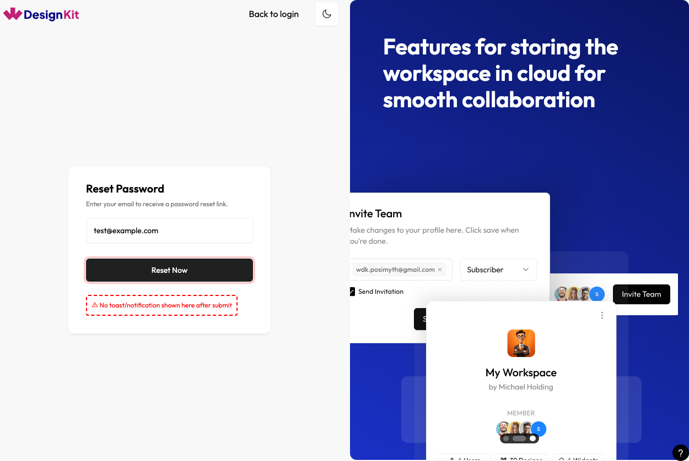
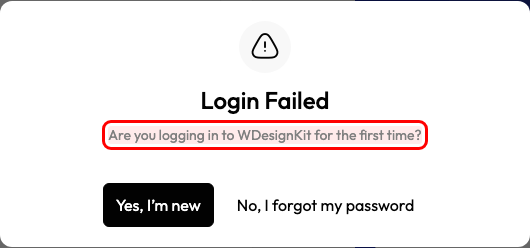
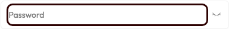
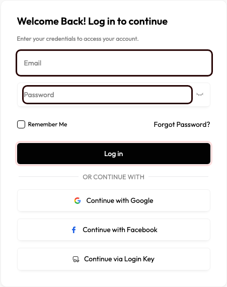
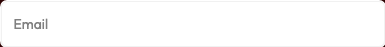

# WDesignKit Plugin — Login Page Bug Report

**Plugin Version:** 2.2.10
**Environment:** WordPress 6.7-php8.2 · Docker localhost:8881
**Test Date:** 2026-04-28
**Tested By:** QA Automation — Playwright (plugin-desktop)
**Test File:** `tests/plugin/login.spec.js`
**Result:** 9 bugs confirmed · 78 tests passed · 9 tests failed
**Test Suite:** 87 tests · 14 sections (updated 2026-04-28)

---

### Google social login link has no href — dead link

**Severity:** P1
**Area:** Functionality

**Issue:** The "Continue with Google" button is an `<a>` element with no `href` attribute (value is `null`). Clicking it produces no action — no OAuth redirect, no navigation. The button looks functional but is completely broken.

**Steps to Reproduce:**
1. Open the WDesignKit plugin page while logged out of WDesignKit
2. View the login panel
3. Click "Continue with Google"

**Expected Result:** User is redirected to Google OAuth for authentication

**Actual Result:** Nothing happens — `href` is `null`, no redirect occurs

---

### Facebook social login link has no href — dead link

**Severity:** P1
**Area:** Functionality

**Issue:** The "Continue with Facebook" button is an `<a>` element with no `href` attribute (value is `null`). Identical to the Google issue — visible and styled correctly but non-functional.

**Steps to Reproduce:**
1. Open the WDesignKit plugin login panel
2. Click "Continue with Facebook"

**Expected Result:** User is redirected to Facebook OAuth for authentication

**Actual Result:** Nothing happens — `href` is `null`, no redirect occurs

---

### Forgot password — no visible feedback after submitting a valid email

**Severity:** P1
**Area:** Functionality

**Issue:** After entering a valid email in the Forgot Password form and clicking "Reset Now", no response is shown — no success toast, no error notification, no confirmation message. The form stays in its default state with no indication that the request was received or failed.

**Steps to Reproduce:**
1. On the login panel click "Forgot Password?"
2. Enter a valid email address (e.g. test@example.com)
3. Click "Reset Now"
4. Wait up to 20 seconds

**Expected Result:** A toast or notification appears confirming the reset link was sent, or an error message if email not found

**Actual Result:** No popup, no toast, no state change — form remains identical after submission

---

### Wrong credentials popup shows misleading "Are you logging in for the first time?" message

**Severity:** P2
**Area:** Logic / UX

**Issue:** When a returning user enters wrong credentials, the error popup says "Are you logging in to WDesignKit for the first time?" with buttons "Yes, I'm new" and "No, I forgot my password." This is misleading — the user simply typed the wrong password. Offering "Yes, I'm new" implies their account does not exist.

**Steps to Reproduce:**
1. On the login panel enter a registered email with an incorrect password
2. Click "Log in"
3. Observe the popup

**Expected Result:** Clear message such as "Incorrect email or password. Please try again."

**Actual Result:** Popup reads — *"Login Failed · Are you logging in to WDesignKit for the first time? · Yes, I'm new · No, I forgot my password"*

---

### Password input missing id attribute — WCAG 1.3.1 failure

**Severity:** P2
**Area:** Accessibility

**Issue:** The password `<input>` has no `id` attribute. Without an `id`, a `<label>` cannot be programmatically associated via `for="..."`. Screen readers announce the field as unlabelled when focused. Violates WCAG 2.1 SC 1.3.1.

**Steps to Reproduce:**
1. Open the login panel
2. Inspect the password input in browser DevTools
3. Check for an `id` attribute

**Expected Result:** `id="WDkitUserPassword"` (or similar) with a matching `<label for="...">`

**Actual Result:** `id` attribute is absent — no label association possible

---

### Login form inputs not wrapped in a form element

**Severity:** P2
**Area:** Functionality / UX

**Issue:** Email and password inputs are placed directly in a `
` with no enclosing `<form>` element. Browser will not offer to save/autofill credentials, password managers cannot detect the form, and pressing Enter from the email field does not submit as expected.

**Steps to Reproduce:**
1. Open the login panel
2. Inspect `.wdkit-form-card` in DevTools
3. Check whether a `<form>` element wraps the inputs

**Expected Result:** All login inputs and submit button are inside a `<form>` element

**Actual Result:** No `<form>` element — inputs sit directly in a `
`

---

### Email input has autocomplete="off" — blocks password managers

**Severity:** P2
**Area:** UX

**Issue:** The email input (`#WDkitUserEmail`) has `autocomplete="off"` explicitly set, blocking all browser-native autofill and password managers (1Password, LastPass, Bitwarden, Dashlane) from filling the field.

**Steps to Reproduce:**
1. Open the login panel
2. Inspect `#WDkitUserEmail` in DevTools
3. Check the `autocomplete` attribute value

**Expected Result:** `autocomplete="email"` or `autocomplete="username"`

**Actual Result:** `autocomplete="off"` — autofill actively blocked

---

### Password input has autocomplete="off" — blocks password managers

**Severity:** P2
**Area:** UX

**Issue:** The password `<input>` also has `autocomplete="off"`, blocking password managers from filling the field and preventing the browser's "save this password?" prompt after login.

**Steps to Reproduce:**
1. Open the login panel
2. Inspect the password input in DevTools
3. Check the `autocomplete` attribute value

**Expected Result:** `autocomplete="current-password"`

**Actual Result:** `autocomplete="off"` — password autofill blocked

---

### "Log in" button tap target is only 42px on mobile — below WCAG minimum

**Severity:** P3
**Area:** Accessibility / Responsive

**Issue:** At 375px viewport (mobile), the "Log in" button renders at 42px height. WCAG 2.1 SC 2.5.5 and both Apple and Google mobile HIG require a minimum touch target of 44px. The button is 2px short.

**Steps to Reproduce:**
1. Open the login panel at 375×812 viewport
2. Measure the rendered height of the "Log in" button

**Expected Result:** Button height ≥ 44px

**Actual Result:** Button height = 42px

---

## Summary

| # | Bug | Severity | Area |
|---|-----|----------|------|
| 1 | Google social login link has no href — dead link | P1 | Functionality |
| 2 | Facebook social login link has no href — dead link | P1 | Functionality |
| 3 | Forgot password — no visible feedback after valid email submit | P1 | Functionality |
| 4 | Wrong credentials popup shows misleading "Are you new?" message | P2 | Logic / UX |
| 5 | Password input missing id attribute — WCAG 1.3.1 failure | P2 | Accessibility |
| 6 | Login form inputs not wrapped in a form element | P2 | Functionality / UX |
| 7 | Email input has autocomplete="off" — blocks password managers | P2 | UX |
| 8 | Password input has autocomplete="off" — blocks password managers | P2 | UX |
| 9 | "Log in" button tap target only 42px on mobile — below 44px WCAG minimum | P3 | Accessibility / Responsive |

**P1 (Critical):** 3 · **P2 (High):** 5 · **P3 (Medium):** 1

**Session Status: ❌ QA FAILED** — 3 open P1 bugs block release sign-off
