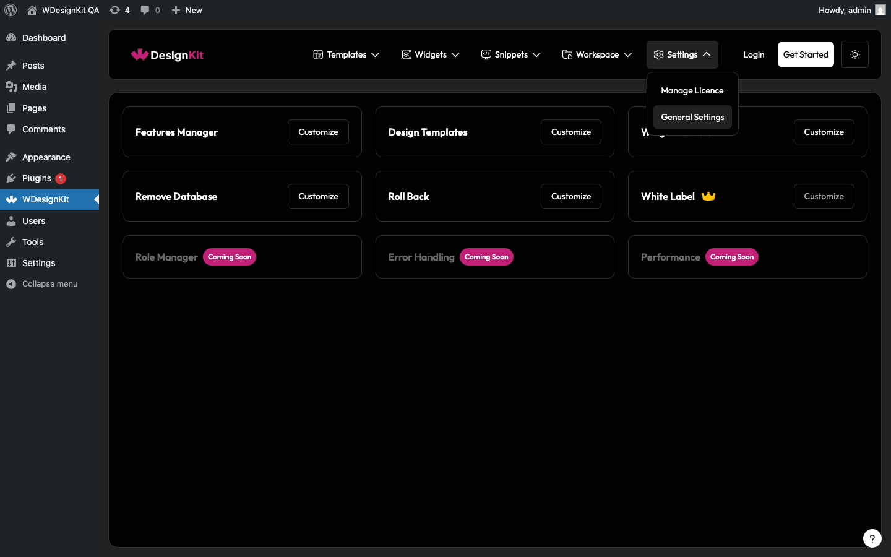
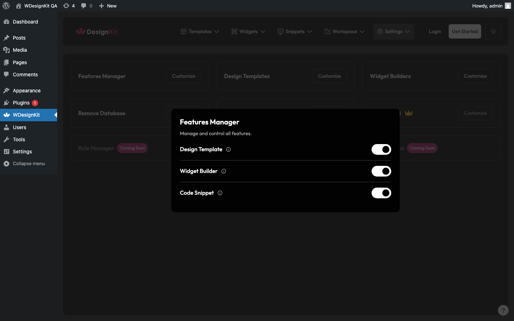
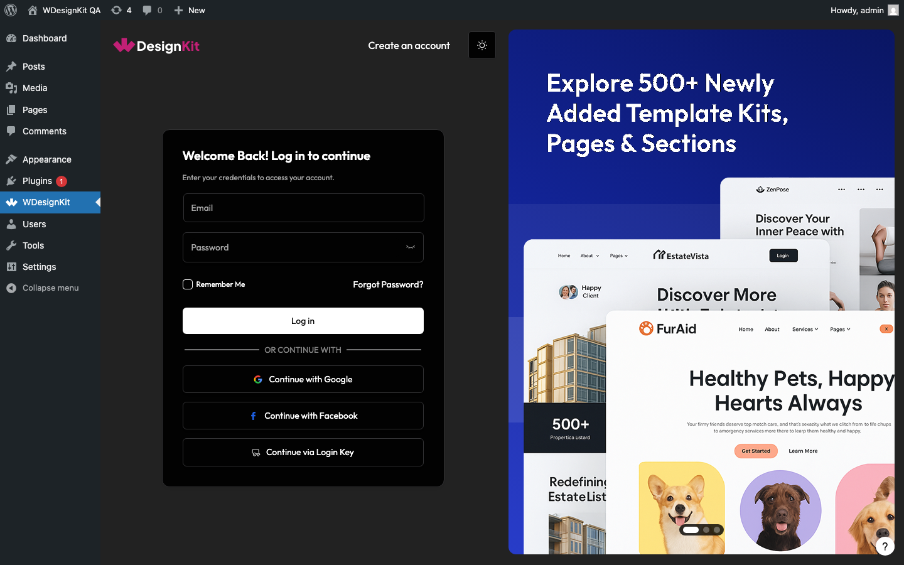
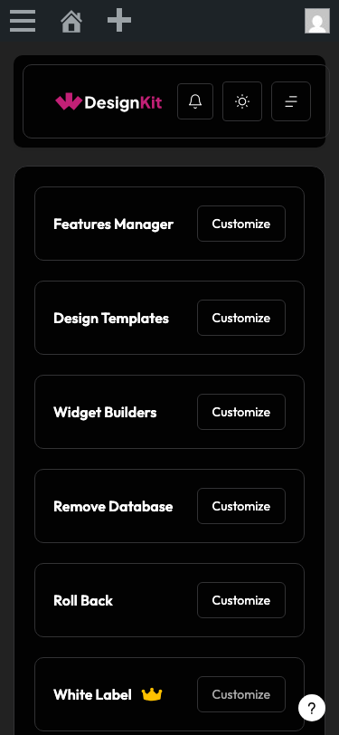

# WDesignKit Plugin — Settings Page Bug Report

**Plugin Version:** 2.2.10
**Environment:** WordPress 6.7-php8.2 · Docker localhost:8881
**Test Date:** 2026-04-28
**Tested By:** QA Automation — Playwright (plugin-desktop)
**Test File:** `tests/plugin/settings.spec.js`
**Result:** 5 bugs confirmed · 56 tests passed · 0 tests failed · 1 skipped
**Test Suite:** 57 tests · 16 sections

---

### "Coming Soon" badge CSS class has a spelling typo — `wdkit-comming-soon-pin`

**Severity:** P3
**Area:** Code Quality / UI

**Issue:** The CSS class used for the "Coming Soon" badges on the Role Manager, Error Handling, and Performance cards is `wdkit-comming-soon-pin` — note the double-m in "comming". The correct English spelling is "coming". This typo is present in both the PHP/HTML markup and the CSS stylesheet, making it a production code quality defect that will affect any future selector references or external integrations.

**Steps to Reproduce:**
1. Navigate to the WDesignKit plugin settings page (`/wp-admin/admin.php?page=wdesign-kit`)
2. Go to General Settings
3. Inspect the "Role Manager", "Error Handling", or "Performance" card in DevTools
4. Check the class attribute of the badge element

**Expected Result:** Class should be `wdkit-coming-soon-pin` (single-m, correct spelling)

**Actual Result:** Class is `wdkit-comming-soon-pin` — "comming" is misspelled throughout the codebase

---

### Toggle checkboxes inside settings popups are not directly clickable — blocked by overlay

**Severity:** P2
**Area:** Functionality / UX

**Issue:** The toggle switch inputs (`input[type="checkbox"]`) inside the Features Manager and Widget Builders popups cannot be clicked directly via standard user interaction. An overlay element intercepts the pointer event before it reaches the checkbox. The toggle appears interactive but requires a workaround (JavaScript `element.click()`) to function. Standard browser clicks, keyboard activation, and any assistive technology that simulates a click will silently fail.

**Steps to Reproduce:**
1. Go to General Settings
2. Click "Customize" on the Features Manager card
3. Attempt to click the "Design Template" toggle switch directly
4. Observe — the checkbox state does not change

**Expected Result:** Clicking the toggle switch changes its checked state and fires the AJAX save request

**Actual Result:** Click is intercepted by an overlay; checkbox state remains unchanged unless JavaScript `.click()` is used directly on the DOM element

---

### White Label upgrade tooltip is completely hidden via CSS — inaccessible to keyboard and screen readers

**Severity:** P2
**Area:** Accessibility / UX

**Issue:** The tooltip on the White Label card (`.wdkit-wl-user-msg`) that explains which plans unlock White Label access (Studio, Agency Bundle) is hidden with `display: none` or equivalent CSS. It is not revealed on hover in a way that is accessible — keyboard users and screen reader users cannot discover the upgrade requirement. The element exists in the DOM but is entirely invisible and unreachable without a mouse hover.

**Steps to Reproduce:**
1. Go to General Settings
2. Locate the White Label card — the Customize button is disabled
3. Try to Tab to or keyboard-navigate to the tooltip
4. Inspect the `.wdkit-wl-user-msg` element in DevTools

**Expected Result:** Tooltip text ("Available on Studio / Agency Bundle") is discoverable via keyboard focus or a visually persistent label, meeting WCAG 1.3.1 and 1.4.13

**Actual Result:** Tooltip is CSS-hidden and not accessible via keyboard or screen reader; `display: none` or equivalent makes the element invisible to all non-mouse users

---

### Manage Licence silently redirects to login page with no explanation when WDesignKit account is not connected

**Severity:** P2
**Area:** Logic / UX

**Issue:** When a WordPress admin navigates to Manage Licence without having connected a WDesignKit account, the plugin silently redirects to `#/login` with no context. The user sees a generic login form with no message explaining *why* they were redirected — no "You need to connect your WDesignKit account to manage your licence" guidance. This creates confusion as the user is already authenticated as a WP admin.

**Steps to Reproduce:**
1. Ensure no WDesignKit account is connected in the plugin
2. Go to General Settings
3. Click "Manage Licence" in the left sidebar submenu
4. Observe the hash route and page content

**Expected Result:** Page shows a clear message: "Connect your WDesignKit account to activate and manage your licence" with the login form presented in context

**Actual Result:** Silent redirect to `#/login` with no contextual guidance — user does not know why they were redirected

---

### Mobile sidebar navigation is inaccessible without hamburger — Settings page navigation requires hash injection

**Severity:** P2
**Area:** Responsive / Functionality

**Issue:** At 375px viewport (mobile), the left sidebar navigation is hidden behind a hamburger button (`.wdkit-hamburger-btn`). Navigating to General Settings requires either opening the hamburger menu first or manually injecting `location.hash = '/settings'`. There is no visible fallback or entry point on the main settings screen for mobile users to navigate between "General Settings" and "Manage Licence". The navigation pattern is broken at the mobile breakpoint — the user can reach the settings page but has no visible way to switch between sub-sections.

**Steps to Reproduce:**
1. Open the WDesignKit plugin at 375×812 viewport (mobile)
2. Navigate to the settings page
3. Attempt to switch between "General Settings" and "Manage Licence" sub-items
4. Observe — both options are hidden behind the hamburger

**Expected Result:** A visible, accessible navigation control exists on mobile to switch between settings sub-sections, meeting WCAG 2.1 SC 2.4.3 and Google mobile HIG

**Actual Result:** Sub-navigation is entirely hidden; only a hamburger icon is present and it does not reveal an obvious way to reach sub-menu items

---

## Summary

| # | Bug | Severity | Area |
|---|-----|----------|------|
| 1 | "Coming Soon" badge CSS class has a spelling typo — `wdkit-comming-soon-pin` | P3 | Code Quality / UI |
| 2 | Toggle checkboxes inside popups blocked by overlay — not directly clickable | P2 | Functionality / UX |
| 3 | White Label upgrade tooltip hidden via CSS — inaccessible to keyboard and screen readers | P2 | Accessibility / UX |
| 4 | Manage Licence silently redirects to login with no contextual explanation | P2 | Logic / UX |
| 5 | Mobile sidebar navigation hidden behind hamburger — settings sub-sections unreachable | P2 | Responsive / Functionality |

**P2 (High):** 4 · **P3 (Medium):** 1

---

## Test Results

| Metric | Count |
|--------|-------|
| Total tests | 57 |
| Passed | 56 |
| Failed | 0 |
| Skipped | 1 |

**Skipped test:** "Manage Licence shows licence controls when WDesignKit account is active" — requires a test account with an active WDesignKit licence key; marked for manual verification.

---

## Section Breakdown

| # | Section | Tests | Result |
|---|---------|-------|--------|
| 1 | Navigation & Load | 6 | ✅ All passed |
| 2 | Card Overview | 10 | ✅ All passed |
| 3 | Features Manager Popup | 7 | ✅ All passed |
| 4 | Widget Builders Popup | 6 | ✅ All passed |
| 5 | Design Templates Popup | 2 | ✅ All passed |
| 6 | Remove Database Popup | 2 | ✅ All passed |
| 7 | Roll Back Popup | 2 | ✅ All passed |
| 8 | White Label Card | 3 | ✅ All passed |
| 9 | Dark Mode Toggle | 3 | ✅ All passed |
| 10 | Manage Licence Page | 3 | ✅ 2 passed · 1 skipped |
| 11 | Agency Bundle White Label | 1 | ✅ All passed |
| 12 | Access Control | 2 | ✅ All passed |
| 13 | Responsive 375px | 3 | ✅ All passed |
| 14 | Responsive 768px | 2 | ✅ All passed |
| 15 | Responsive 1440px | 2 | ✅ All passed |
| 16 | AJAX Sanity | 2 | ✅ All passed |

**Session Status: ⚠️ QA IN REVIEW** — 4 open P2 bugs require dev attention before release sign-off. No P0/P1 blockers. Functional core is stable.
