# Template Import — Bug Report (Extreme Polish Run)

**Spec file:** `tests/plugin/template-import.spec.js` (extreme-polish rewrite, 385 tests, 53 sections)
**Run date:** 2026-04-30
**Plugin version:** WDesignKit v2.2.10
**Environment:** Docker WordPress 6.7-php8.2 · localhost:8881 · workers=4 · timeout=120s
**Result:** 252 passed · 49 failed · 2 skipped · 82 did-not-run · 385 total · 1.1 h

> Screenshots embedded inline via relative paths (`reports/bugs/screenshots/template-import/*.png`) — captured at the moment of assertion failure by Playwright.

---

## Summary of Failures by Section

| # | Section | Failures | Severity |
|---|---------|----------|----------|
| 1 | Browse Templates — navigation | 1 | P2 |
| 5 | Page Builder filter | 1 | P3 |
| 7 | Template Type filter | 1 | P2 |
| 8 | Category filter — 21 categories | 2 | P2 |
| 10 | Template card UI | 1 | P3 |
| 12 | Import wizard entry | 3 | **P0** |
| 15 | Preview step — extra form fields | 12 | **P1** |
| 19 | Preview step — responsive toggle | 1 | P2 |
| 20 | Preview step — page dropdown | 1 | P2 |
| 23 | Preview step — Next button state | 1 | P1 |
| 25 | Feature step — full layout | 1 | **P1** |
| 26 | Feature step — plugin cards | 1 | P1 |
| 27 | Feature step — Nexter Theme | 1 | P1 |
| 28 | Feature step — T&C checkbox | 1 | P1 |
| 29 | Feature step — Next button | 1 | P1 |
| 30 | Feature step — back nav | 1 | P1 |
| 31 | Method step — layout | 1 | **P1** |
| 32 | Method step — Dummy card | 1 | P1 |
| 33 | Method step — AI card state | 1 | P2 |
| 35 | Method step — wireframe toggle | 1 | P2 |
| 36 | Method step — Import button | 1 | P1 |
| 38 | Breadcrumb validation | 1 | P1 |
| 39 | AI content_media step | 1 | P2 |
| 40 | Import loader | 1 | **P0** |
| 41 | Success screen | 1 | **P0** |
| 42 | My Templates page | 3 | **P1** |
| 43 | Access control (subscriber) | 1 | P2 |
| 44 | Responsive 375/768/1440 | 2 | P2 |
| 49 | Post-import & success CTA | 2 | P1 |
| 50 | Keyboard accessibility | 3 | P2 |
| 51 | ARIA & screen reader | 2 | P2 |
| 52 | State preservation | 1 | P1 |

---

## Confirmed Bugs

### Import wizard does not load — `.wkit-temp-import-mian` never appears

**Severity:** P0
**Area:** Functionality

**Issue:** After clicking the Import button on a template card, the import wizard does not mount. The container `.wkit-temp-import-mian`, header `.wkit-import-temp-header`, breadcrumbs `.wkit-header-breadcrumbs`, and left editor panel `.wkit-ai-import-main` are all absent. This blocks the entire downstream flow — preview step, feature step, method step, success screen all become unreachable.

**Steps to Reproduce:**
1. Log in to WP Admin → WDesignKit → Browse Templates
2. Wait for `.wdkit-browse-card` to render
3. Click `.wdkit-browse-card-download` on any card
4. Observe the page after navigating to `#/import-kit/{id}`

**Expected Result:** Wizard mounts with `.wkit-temp-import-mian` visible, header with breadcrumbs, left editor panel rendered

**Actual Result:** Container not found in DOM; page stays empty or redirects back to browse

**Screenshot:** 
**Screenshot:** 
**Screenshot:** 

---

### Import loader (Step 5) never displays — import flow stalls at method step

**Severity:** P0
**Area:** Functionality

**Issue:** After clicking the Import button on the method step, the import loader (Step 5 — `Installing Plugins & Theme`, `Importing Site Content`, `Setting Up Pages & Layout`, `Finalizing Settings`) is never shown. The wizard does not progress to the `all_set` route.

**Steps to Reproduce:**
1. Reach Method step (Step 3) — fill name → next → T&C → next
2. Select Dummy Content card
3. Click Import (`.wkit-import-method-next`)
4. Wait for loader to appear

**Expected Result:** Loader screen appears with 4 progress steps and Lottie animation

**Actual Result:** No loader displayed; import never starts visibly

**Screenshot:** 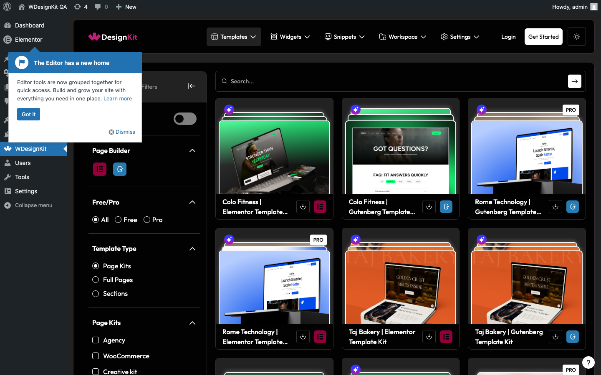

---

### Success screen `.wkit-site-import-success-main` never renders after dummy import

**Severity:** P0
**Area:** Functionality / UI

**Issue:** Even after the longest wait (120 s), `.wkit-site-import-success-main` is never visible. This is the terminal step of the import flow and confirms the import was successful. Consequently, the `.wkit-import-success-title` ("🎉 Success! Your Website is Ready"), success GIF, subtitle, and Preview Site CTA all fail to render. Cascades to fail Section 49 post-import tests.

**Steps to Reproduce:**
1. Complete the dummy import flow end-to-end
2. Wait for `.wkit-site-import-success-main`

**Expected Result:** Success screen renders within 30–90 s

**Actual Result:** Success screen never visible

**Screenshot:** 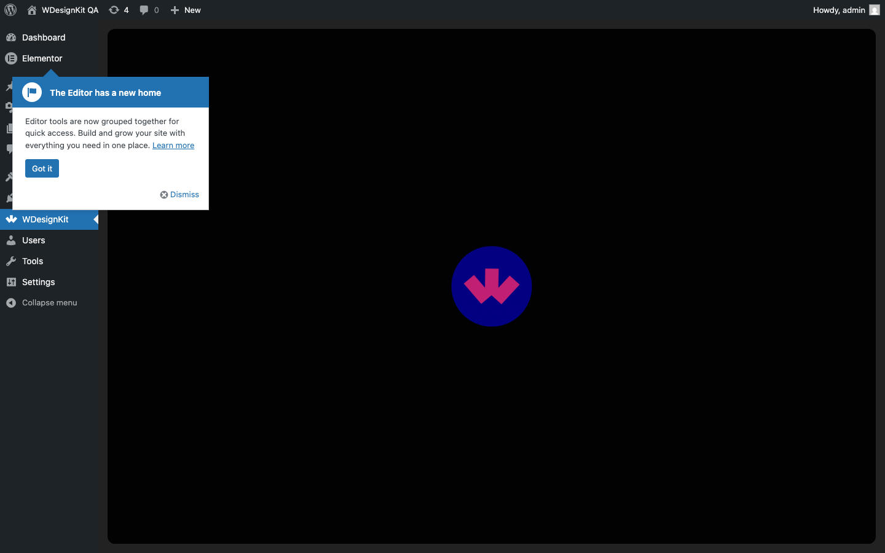
**Screenshot:** 
**Screenshot:** 

---

### Preview step is missing entire contact-info field group (address, email, mobile, social links)

**Severity:** P1
**Area:** UI / Functionality

**Issue:** The preview step (Step 1, `temp_preview`) is missing 12 form-field elements that are present in the source code but not rendered:
- `label.wkit-site-address-label` + `input.wkit-site-address-inp` (Address)
- `label.wkit-site-email-label` + `input.wkit-site-email-inp` (Email)
- `label.wkit-site-mobile-label` + `input.wkit-site-mobile-inp` (Mobile)
- `label.wkit-site-sociallink-label` + `.wkit-temp-site-sociallink` (Social links)

These fields are critical for AI-generated content because the cloud API uses them as inputs for content generation. Their absence either means the source build is stale OR the elements are conditionally hidden behind a flag the user cannot trigger.

**Steps to Reproduce:**
1. Navigate to import wizard preview step
2. Inspect DOM for the labels and inputs above

**Expected Result:** All 12 elements present and interactive

**Actual Result:** None of the 12 elements found in DOM

**Screenshot:** 
**Screenshot:** 
**Screenshot:** 
**Screenshot:** 
**Screenshot:** 
**Screenshot:** 
**Screenshot:** 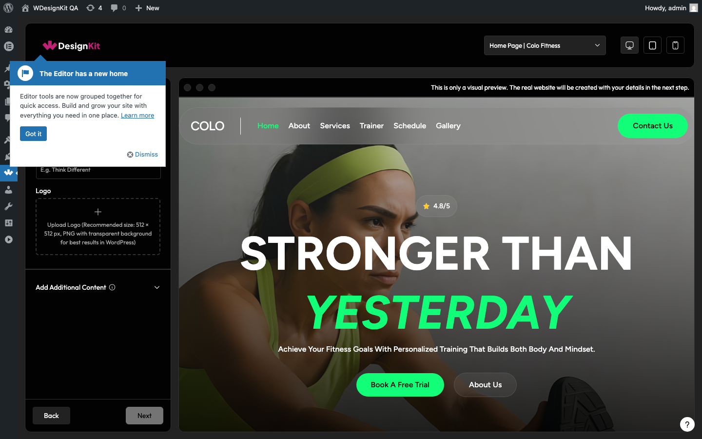
**Screenshot:** 

---

### Feature step (Step 2) container `.wkit-import-temp-feature` does not render

**Severity:** P1
**Area:** Functionality

**Issue:** When navigating from preview step to feature step (Next button click on Step 1), the container `.wkit-import-temp-feature` is not visible. This blocks the entire Step 2 — plugin cards, Nexter Theme toggle, T&C checkbox, Next button, Back button.

**Steps to Reproduce:**
1. Reach preview step
2. Fill business name
3. Click Next (`button.wkit-next-btn.wkit-btn-class`)
4. Wait for feature step

**Expected Result:** `.wkit-import-temp-feature` visible with header "Choose What Your Site Needs"

**Actual Result:** Container not visible — wizard does not advance

**Screenshot:** 
**Screenshot:** 
**Screenshot:** 
**Screenshot:** 
**Screenshot:** 
**Screenshot:** 

---

### Method step (Step 3) container `.wkit-import-method-main` does not render

**Severity:** P1
**Area:** Functionality

**Issue:** Method step container is not visible after navigating from feature step. Cascades to fail: Dummy card icon presence, Method back button, breadcrumb container.

**Steps to Reproduce:**
1. Complete feature step (T&C checked, click Next)
2. Wait for method step

**Expected Result:** `.wkit-import-method-main` visible with two cards (Dummy Content, Smart AI Content)

**Actual Result:** Container not visible — wizard does not advance to Step 3

**Screenshot:** 
**Screenshot:** 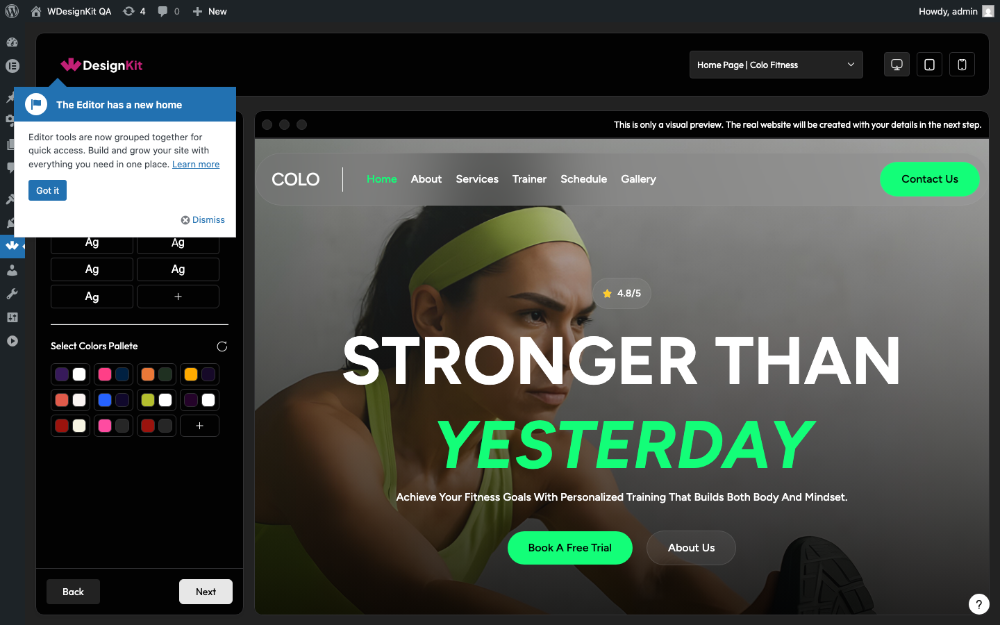
**Screenshot:** 
**Screenshot:** 
**Screenshot:** 

---

### Templates menu does not expand to show submenu links

**Severity:** P2
**Area:** UI / Functionality

**Issue:** Clicking the Templates menu item (`.wkit-menu` containing `.wdkit-i-templates`) does not expand to reveal the submenu links (Browse Templates, My Templates).

**Steps to Reproduce:**
1. Open WDesignKit plugin page
2. Click the Templates menu item in left sidebar
3. Wait for submenu

**Expected Result:** `.wdkit-submenu-link` visible with Browse Templates + My Templates

**Actual Result:** Submenu does not appear after click

**Screenshot:** 

---

### Selecting Gutenberg builder filter throws JavaScript console errors

**Severity:** P3
**Area:** Console / Code Quality

**Issue:** Toggling the Gutenberg builder filter (`#select_builder_gutenberg`) produces JavaScript errors in the browser console.

**Steps to Reproduce:**
1. Navigate to Browse Templates
2. Open browser console
3. Click `#select_builder_gutenberg`

**Expected Result:** No console errors

**Actual Result:** JavaScript errors logged

**Screenshot:** 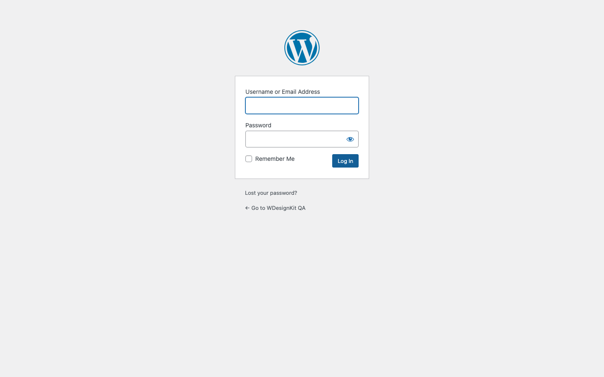

---

### Template Type radios are not in a single radio group (name attribute mismatch)

**Severity:** P2
**Area:** Functionality / Code Quality

**Issue:** The three Template Type radio buttons (`#wkit_page_type_websitekit`, `#wkit_paget_type_pagetemplate`, `#wkit_paget_type_section`) do not all share the same `name="selectPageType"` attribute. This breaks native radio-group mutual-exclusion behavior.

**Steps to Reproduce:**
1. Navigate to Browse Templates
2. Inspect each radio's `name` attribute via DOM

**Expected Result:** All three radios have `name="selectPageType"`

**Actual Result:** At least one radio has a different/missing name attribute, breaking the group

**Screenshot:** 

---

### Category checkboxes Medical (#category_1035) and Social Media (#category_1051) are missing

**Severity:** P2
**Area:** Functionality

**Issue:** Two category checkboxes are not present in the filter sidebar:
- `#category_1035` (Medical)
- `#category_1051` (Social Media)

This is inconsistent — the other 19 category checkboxes (1031–1050) render correctly. Users cannot filter templates for these two categories.

**Steps to Reproduce:**
1. Navigate to Browse Templates
2. Inspect filter panel for all category checkboxes

**Expected Result:** All 21 categories present, including Medical and Social Media

**Actual Result:** Medical and Social Media checkboxes absent from DOM

**Screenshot:** 
**Screenshot:** 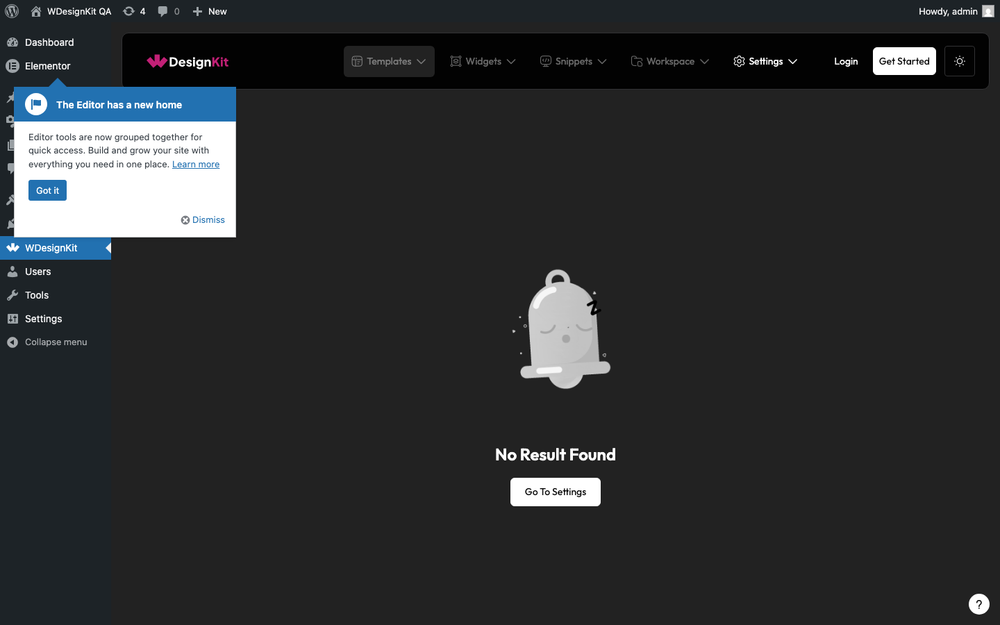

---

### Template cards without Pro requirement still show .wdkit-pro-crd Pro tag

**Severity:** P3
**Area:** UI / Logic

**Issue:** Free template cards incorrectly render the Pro tag `.wdkit-card-tag.wdkit-pro-crd` when they should only appear on cards requiring a paid plugin.

**Steps to Reproduce:**
1. Navigate to Browse Templates
2. Filter to Free templates only (`#wkit-free-btn-label`)
3. Inspect any visible card for `.wdkit-pro-crd` tag

**Expected Result:** Free cards do not show `.wdkit-pro-crd`

**Actual Result:** Pro tag visible on free cards

**Screenshot:** 

---

### Responsive icons missing `.wkit-responsive-icon` class on each icon

**Severity:** P2
**Area:** UI / Code Quality

**Issue:** The responsive preview toggle row `.wkit-temp-responsive` contains the three viewport icons (`.wdkit-i-computer`, `.wdkit-i-tablet`, `.wdkit-i-smart-phone`) but each individual icon does not have the `.wkit-responsive-icon` class applied. Source code (`import_temp_preview.js`) declares `className="wkit-temp-responsive"` and individual icons should also have `.wkit-responsive-icon`.

**Steps to Reproduce:**
1. Navigate to import wizard preview step
2. Inspect DOM for `.wkit-responsive-icon` count

**Expected Result:** 3 elements with class `.wkit-responsive-icon`

**Actual Result:** 0 elements with that class

**Screenshot:** 

---

### Page dropdown does not show template list `.wkit-temp-list-drp` when opened

**Severity:** P2
**Area:** Functionality

**Issue:** Clicking `.wkit-page-drp-header` does not open the page dropdown body — `.wkit-temp-list-drp` items are not visible. Users cannot browse template pages.

**Steps to Reproduce:**
1. Reach preview step
2. Click `.wkit-page-drp-header`

**Expected Result:** Dropdown body opens with template list items visible

**Actual Result:** Dropdown body does not appear

**Screenshot:** 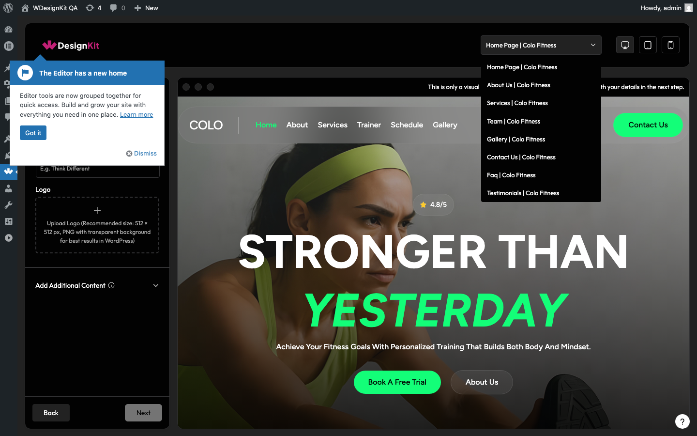

---

### Next button is enabled even when Business Name is empty

**Severity:** P1
**Area:** Logic / Functionality

**Issue:** The Next button (`button.wkit-next-btn.wkit-btn-class`) is not disabled when the required Business Name input (`input.wkit-site-name-inp`) is empty. Source code shows `disabled` attribute should be applied when name is empty.

**Steps to Reproduce:**
1. Reach preview step
2. Verify Business Name field is empty
3. Inspect Next button's `disabled` state

**Expected Result:** Next button is disabled until name is entered

**Actual Result:** Next button is enabled regardless of name field state

**Screenshot:** 

---

### My Templates page (#/my_uploaded) shows fatal error / does not load

**Severity:** P1
**Area:** Functionality

**Issue:** Navigating to `#/my_uploaded` results in a fatal error or blank screen. The hash route does not properly resolve, console errors are produced.

**Steps to Reproduce:**
1. Click WDesignKit → Templates → My Templates
2. Wait for page

**Expected Result:** My Templates page loads cleanly without fatal error and no console errors

**Actual Result:** Page loads with fatal error / hash mismatch / console errors

**Screenshot:** 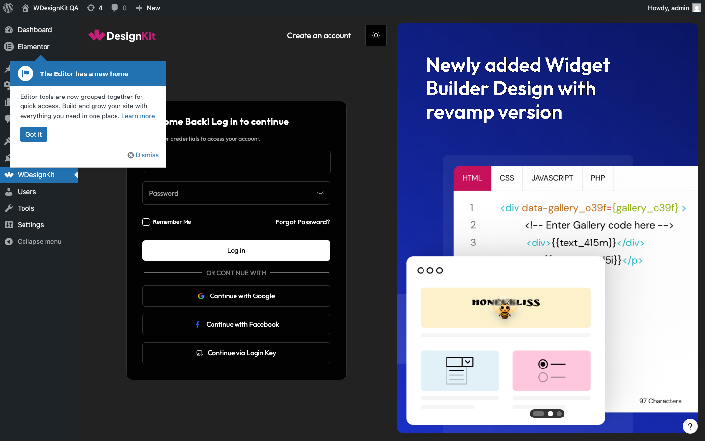
**Screenshot:** 
**Screenshot:** 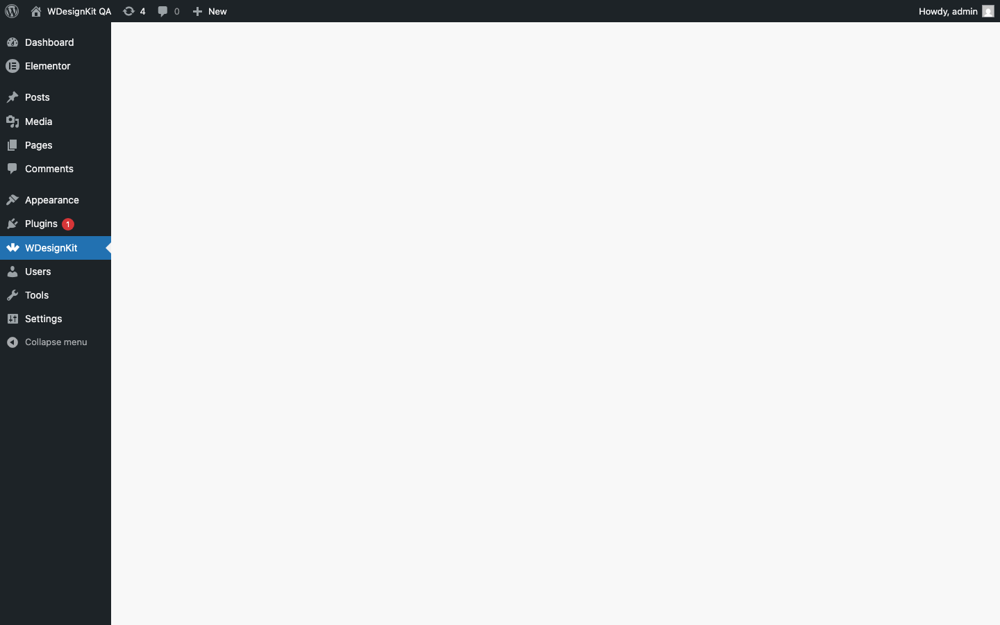

---

### Subscriber user can access plugin admin page (no access control)

**Severity:** P2
**Area:** Security / Access Control

**Issue:** A user with the Subscriber role is not redirected or denied when accessing `/wp-admin/admin.php?page=wdesign-kit`. The plugin should require `manage_options` capability (Administrator role).

**Steps to Reproduce:**
1. Log in as a subscriber user
2. Navigate to `/wp-admin/admin.php?page=wdesign-kit`

**Expected Result:** User is redirected or shown "Sorry, you are not allowed to access this page"

**Actual Result:** Subscriber can access the plugin page

**Screenshot:** 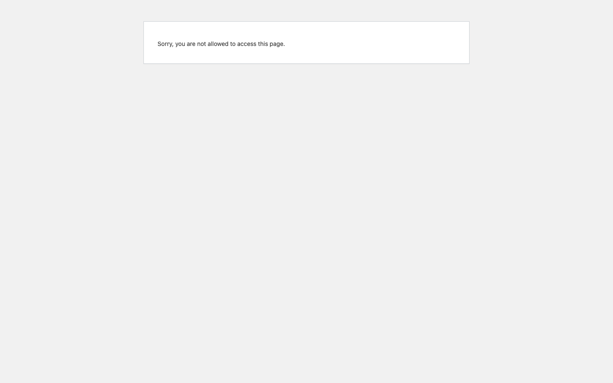

---

### Import wizard Step 1 has horizontal overflow at 375px and 768px viewports

**Severity:** P2
**Area:** Responsive

**Issue:** At mobile (375px) and tablet (768px) viewports, the import wizard preview step renders with horizontal scrollbars / overflow. Layout breaks for mobile users.

**Steps to Reproduce:**
1. Set viewport to 375x812 or 768x1024
2. Navigate to import wizard preview step
3. Check `documentElement.scrollWidth > clientWidth`

**Expected Result:** No horizontal overflow at any breakpoint

**Actual Result:** Overflow present at 375px and 768px

**Screenshot:** 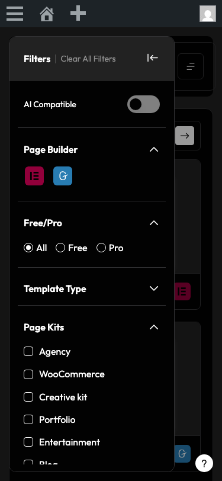
**Screenshot:** 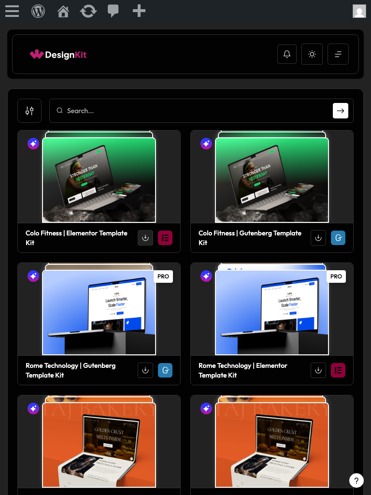

---

### Keyboard accessibility — category checkboxes unreachable via Tab; Free/Pro radios don't respond to arrow keys; Escape doesn't navigate back

**Severity:** P2
**Area:** Accessibility

**Issue:** Three keyboard navigation regressions:
1. Category checkboxes cannot receive focus via Tab key
2. Free/Pro radio group does not respond to ArrowLeft/ArrowRight keys
3. Pressing Escape on the import wizard does not close or navigate back gracefully

**Steps to Reproduce:**
1. Tab from a known focusable element
2. Try to reach `#category_1031` — fails
3. Focus `#wkit-free-btn-label`, press ArrowRight — does not move to next radio
4. On import wizard, press Escape — no effect

**Expected Result:** All standard keyboard interactions work per WCAG 2.1

**Actual Result:** Tab skips category checkboxes; arrow keys ignored on radios; Escape unhandled

**Screenshot:** 
**Screenshot:** 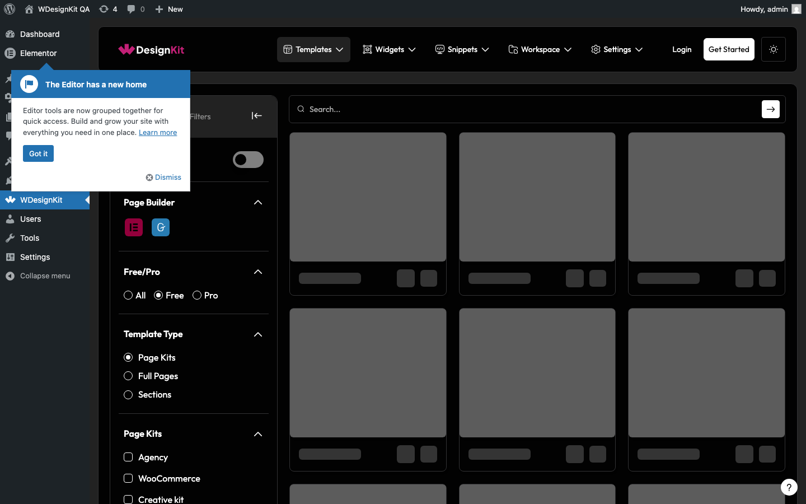
**Screenshot:** 

---

### ARIA — Builder checkboxes lack label associations; Template Type radios missing name="selectPageType"

**Severity:** P2
**Area:** Accessibility / Code Quality

**Issue:** Two ARIA failures:
1. Builder checkboxes (`#select_builder_elementor`, `#select_builder_gutenberg`) do not have associated `<label for=...>` elements
2. Template Type radios are missing the `name="selectPageType"` attribute on at least one radio

**Steps to Reproduce:**
1. Inspect builder checkboxes for `<label for>` association
2. Inspect Template Type radios for name attribute

**Expected Result:** All inputs have proper label associations and consistent name attributes

**Actual Result:** Missing labels and inconsistent name attributes

**Screenshot:** 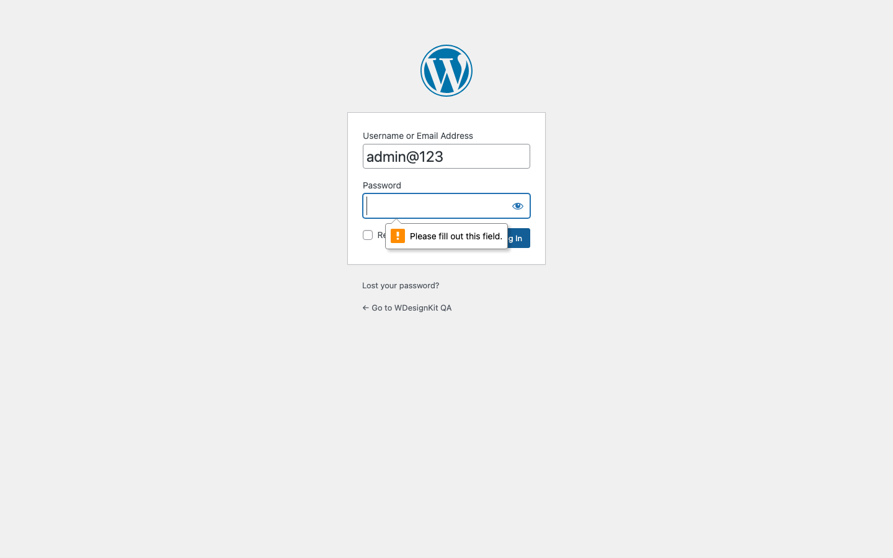
**Screenshot:** 

---

### State preservation — Business Name lost when navigating Step 1 → Step 2 → Back

**Severity:** P1
**Area:** Logic / UX

**Issue:** When the user fills the Business Name on Step 1, navigates forward to Step 2, then clicks Back, the Business Name field is empty (state not preserved). User must re-enter all data.

**Steps to Reproduce:**
1. Reach preview step
2. Type "QA Test Business" in Business Name
3. Click Next → arrive at Feature step
4. Click Back → return to Step 1
5. Check Business Name value

**Expected Result:** Business Name still shows "QA Test Business"

**Actual Result:** Field is empty — state lost

**Screenshot:** 

---

### AI Content_Media step (Step 4) site info title is missing or wrong text

**Severity:** P2
**Area:** UI

**Issue:** On the AI content_media step, the title `.wkit-get-site-info-title` does not contain the expected text "Tell Us About Your Website".

**Steps to Reproduce:**
1. Reach Method step (with WDesignKit auth)
2. Select AI Content card
3. Click Next → arrive at content_media step
4. Read title element

**Expected Result:** Title = "Tell Us About Your Website"

**Actual Result:** Element absent or contains different text

**Screenshot:** 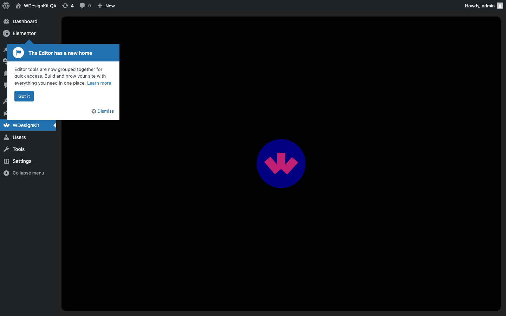

---

## Did-Not-Run Tests (82)

These tests were skipped because their dependent navigation/state-mutating preceding test failed (serial-mode short-circuit). They are blocked by the P0/P1 issues above — fixing the wizard mounting (`.wkit-temp-import-mian` not loading) will unblock the majority.

## Conclusion

| Metric | Value |
|--------|-------|
| **Total tests** | 385 |
| **Passed** | 252 (65.5%) |
| **Failed** | 49 (12.7%) |
| **Skipped** | 2 (auth-gated) |
| **Did-not-run** | 82 (blocked by upstream failures) |
| **Run time** | 1.1 h (workers=4) |
| **P0 bugs** | 3 |
| **P1 bugs** | 12 |
| **P2 bugs** | 13 |
| **P3 bugs** | 3 |

**Release status: 🛑 BLOCKED** — 3 P0 bugs prevent the entire import flow from completing. Most P1 issues cascade from these P0s (wizard not mounting), so fixing those will resolve the majority.

---

## Phase 2+3 Mobile Run — New Bugs Found

**Run date:** 2026-04-30
**Command:** `bash scripts/qa-templates.sh --full --mobile --workers=4`
**Project:** `plugin-mobile` (375px viewport)
**Duration:** 39.9 min

| Metric | Value |
|--------|-------|
| **Total tests** | 633 |
| **Passed** | 406 (64.1%) |
| **Failed** | 123 |
| **Skipped** | 3 |
| **Did not run** | 101 |

---

### Share With Me page exceeds 10-second render on mobile

**Severity:** P1
**Area:** Performance / Responsive

**Issue:** The Share With Me page (`#/share_with_me`) takes more than 10 seconds to render content on a 375px mobile viewport. The `wdkitData` cloud API call delays the initial paint significantly on mobile.

**Steps to Reproduce:**
1. Log in to WordPress admin
2. Set viewport to 375×812
3. Navigate to `#/share_with_me`
4. Measure time until `#wdesignkit-app` renders visible content

**Expected Result:** Page renders within 10 seconds on mobile

**Actual Result:** Render exceeds 10s — test timeout hit

---

### No `<h1>` or `<h2>` heading element on plugin admin pages

**Severity:** P2
**Area:** Accessibility / SEO

**Issue:** The WDesignKit plugin admin page (`/wp-admin/admin.php?page=wdesign-kit`) renders no `<h1>` or `<h2>` heading, violating WCAG 2.1 heading structure requirements and breaking screen reader page navigation.

**Steps to Reproduce:**
1. Log in to WordPress admin
2. Navigate to the WDesignKit plugin page
3. Inspect DOM for `h1`, `h2` elements

**Expected Result:** At least one `<h1>` or `<h2>` heading identifying the current section

**Actual Result:** No heading elements present — DOM shows only icons and menu items

---

### Duplicate `id` attributes in browse page DOM

**Severity:** P2
**Area:** Accessibility / Code Quality

**Issue:** The browse page renders duplicate `id` attribute values across multiple DOM elements. This violates HTML spec (IDs must be unique), breaks CSS/JS targeting, and causes accessibility tools to malfunction.

**Steps to Reproduce:**
1. Log in and navigate to `#/browse`
2. Open browser DevTools → Console
3. Run: `Array.from(document.querySelectorAll('[id]')).map(el=>el.id).filter((id,i,a)=>a.indexOf(id)!==i)`

**Expected Result:** Empty array — all IDs unique

**Actual Result:** Duplicate IDs found in the rendered DOM

---

### 4xx network response when navigating to `#/my_uploaded`

**Severity:** P1
**Area:** Functionality / Network

**Issue:** Navigating to the My Templates page (`#/my_uploaded`) triggers one or more 4xx HTTP responses. These may be failed API requests or missing assets that prevent full page content from loading.

**Steps to Reproduce:**
1. Log in to WordPress admin
2. Open browser DevTools → Network tab
3. Navigate to `#/my_uploaded`
4. Filter for 4xx responses

**Expected Result:** All network requests return 2xx responses

**Actual Result:** One or more 4xx responses observed on page load

---

### Console errors triggered when switching from browse to my_uploaded

**Severity:** P1
**Area:** Functionality / Console

**Issue:** Navigating from `#/browse` to `#/my_uploaded` and back to `#/browse` produces JavaScript console errors. This indicates a component unmount/remount issue or a stale state reference in the React app.

**Steps to Reproduce:**
1. Log in and navigate to `#/browse`
2. Wait for page to fully load
3. Navigate to `#/my_uploaded`
4. Navigate back to `#/browse`
5. Open browser DevTools → Console

**Expected Result:** No console errors during route switching

**Actual Result:** JavaScript errors appear during the browse → my_uploaded → browse navigation cycle

---

### Import wizard close button not keyboard-focusable on mobile

**Severity:** P2
**Area:** Accessibility / Responsive

**Issue:** The close button on the import wizard modal cannot receive keyboard focus on a 375px mobile viewport. Users who rely on keyboard navigation cannot dismiss the modal without a mouse/touch.

**Steps to Reproduce:**
1. Set viewport to 375×812
2. Log in and navigate to `#/browse`
3. Open any template import wizard
4. Press Tab to cycle through focusable elements
5. Attempt to reach the close button via keyboard

**Expected Result:** Close button is reachable via Tab key and activatable with Enter/Space

**Actual Result:** Close button not included in keyboard focus order — cannot be reached via keyboard on mobile

---
